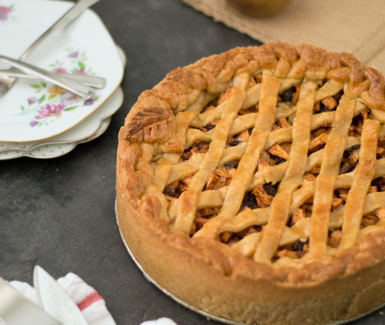

## Inleiding
In deze opdracht ga je oefenen met wat je tot nu geleerd hebt over beslissingsstructuren en methodes. En het laten uitprinten van een appeltaart recept door je applicatie!

## Opzetten van een nieuw Java project

1. Open IntelliJ op je computer.

2. Kies rechts bovenin voor _New project_.

3. Op het volgende scherm zie je linksboven dat _Java_ blauw geselecteerd is. Daar klik je op _Next_.

4. Op het volgende scherm hoeven we niks te selecteren en kunnen we gewoon op _Next_ klikken.

5. Op het volgende scherm kunnen we een naam meegeven aan het project. Kies altijd een beschrijvende naam die iets zegt over je project zodat je ook weet wat erin staat. Bijvoorbeeld "javaOpdracht1".

6. Klik daarna op 'Finish'. 

## Opdrachtbeschrijving

Maak in het nieuwe Java project dat je hebt gemaakt een main klasse en een `public static void main` methode. 

We gaan het volgende appeltaart recept uit laten printen door de applicatie:

Ingrediénten:

- 200 gram ongezouten roomboter
- 200 gram witte bastard suiker
- 400 gram zelfrijzend bakmeel
- 1 stuk(s) ei
- 8 gram vanillesuiker
- 1 snuf zout
- 1.5 kilo zoetzure appels
- 75 gram kristal suiker
- 3 theelepels kaneel
- 15 gram paneermeel

Stappen:
- Verwarm de oven van te voren op 170 graden Celsius (boven en onderwarmte)
- Klop het ei los en verdeel deze in twee delen. De ene helft is voor het deeg, het andere deel is voor het bestrijken van de appeltaart.
- Meng de boter, bastard suiker, zelfrijzend bakmeel, een helft van het ei, vanille suiker en een snufje zout tot een stevig deeg en verdeel deze in 3 gelijke delen.
- Schil nu de appels en snij deze in plakjes. Vermeng in een kopje de suiker en kaneel.
- Vet de springvorm in en bestrooi deze met bloem
- Gebruik een deel van het deeg om de bodem van de vorm te bedekken. Gebruik een deel van het deeg om de rand van de springvorm te bekleden. Strooi het paneermeel op de bodem van de beklede vorm. De paneermeel neemt het vocht van de appels op.
- Doe de heft van de appels in de vorm en strooi hier 1/3 van het kaneel-suiker mengsel overheen. Meng de ander helft van de appels met het overgebleven kaneel-suiker mengsel en leg deze in de vorm. 
- Rol het laatste deel van de deeg uit tot een dunne lap en snij stroken van ongeveer 1 cm breed. 
- Leg de stroken kuislings op de appeltaart. Met wat extra deegstroken werk je de rand rondom af. Gebruik het overgebleven ei om de bovenkant van het deeg te bestrijken
- Zet de taart iets onder het midden van de oven. Bak de taart in 60 minuten op 170 graden Celsius (boven en onderwarmte) gaar en goudbruin.

Nou kunnen we dit alles natuurlijk in de main met een System.out.println zetten en dan werkt het. Maar dat is niet wat we gaan doen. We gaan de applicatie netjes opbouwen met de kennis die je tot zo ver hebt opgedaan. 

## Randvoorwaarden
De opdracht moet voldoen aan de volgende voorwaarden:

- minimaal 3 klassen genaamd: `Ingredient`, `ApplePieRecipe` en `Main`
- minimaal 3 variabelen, 2 constructors en getters en setters in `Ingredient`
- minimaal voor elk ingredient dat hierboven genoemd is een object geinstanieerd in `ApplePieRecipe`
- minimaal voor elke stap die hierboven genoemd word een methode die de tekst via een `System.out.println()` uitprint
- minimaal 1 object van het type `ApplePieRecipe` om de tekst uit te kunnen printen in de `Main` klasse

## Stappenplan
Let op: het is uitdagender om jouw eigen stappenplan te maken. Als je niet zo goed weet waar je moet beginnen, kun je onderstaand stappenplan gebruiken.

1. Maak een nieuw project aan in IntelliJ.

2. Maak een nieuwe klasse aan genaamd  'Main'. Doe dit door met de rechter muisknop op de map 'SRC' te klikken, vervolgens klik je op 'New' en dan op 'Java class'. 

3. Maak een `public static void main` methode aan.

4. Maak een nieuwe klasse `Ingredient` aan, dit gaat het framework worden van een ingredient object

5. Maak 3 private variabelen aan binnen de klasse, namelijk `amount`, `unit` en `name`. Geef deze de juiste datatypes.

6. Maak een lege constructor aan en een constructor gevuld met alle 3 de variabelen. Zet ook voor alle variabelen zowel een getter als een setter in deze klasse.

7. Maak een nieuwe klasse `ApplePieRecipe` aan, hier gaan we voor elk van de ingredient van `Ingredient` een object instantieren. 

8. Maak voor iedere stap een `public void ` methode aan genaamd step1, step2 enz. Zet vervolgens een `System.out.println()` in de body van de methode. En laat deze de tekst van de stap uitprinten.

9. Maar dat is eigenlijk niet zo handig om een methode stap1 te noemen. Want wat doet deze methode? Weet ik dat over 2 jaar nog? Nee, hernoem daarom de methodes op een manier dat de naam wat zegt over wat de methode doet. 

10. Maar hoe kunnen we nu deze aanspreken van uit de `Main` klasse? Ja, precies door een object aan te maken van het type `ApplePieRecipe`

11. Roep hiermee van uit de `Main` klasse alle methodes aan  `ApplePieRecipe`, zodat als we de `public static void main` methode laten draaien we alle stappen geprint zien worden.

12. De oplettende student heeft gezien dat we helemaal niets doen met de objecten van `Ingredient`. En dat terwijl we daar zo veel moeite in hebben gestopt. Maar iemand die deze app draait zou ook wel willen weten welke ingredienten nodig zijn voor de recept. Maak daarom een `public void` methode genaamd printIngredients aan in `ApplePieRecipe`. Laat deze methode voor ieder object een `System.out.println("object.getAmount + " " + object.getUnit + " " + object.getName)` uitprinten. (Vervang natuurlijk object met de naam van het object dat je het gegeven bij het instantieren.)

13. Roep ook deze aan vanuit de `Main` methode, zodat eerst de ingredienten een voor een worden geprint gevolgd door elke stap van het recept.

14. Dit is een van de mogelijkheden en is op zich helemaal prima, maar neem ook een kijkje bij de extra opdrachten.

## Extra opdrachten

1. Zou je ook een methode kunnen maken die alle stappen uitprint? Dan hoef je niet alle methode aan te roepen van uit de `Main` klasse. Ziet dat er niet een stuk netter uit?
2. Zou je dit misschien met meer recepten kunenn doen? Probeer zelf een recept toe te voegen en op de zelfde manier uit te voeren als het appeltaart recept.
